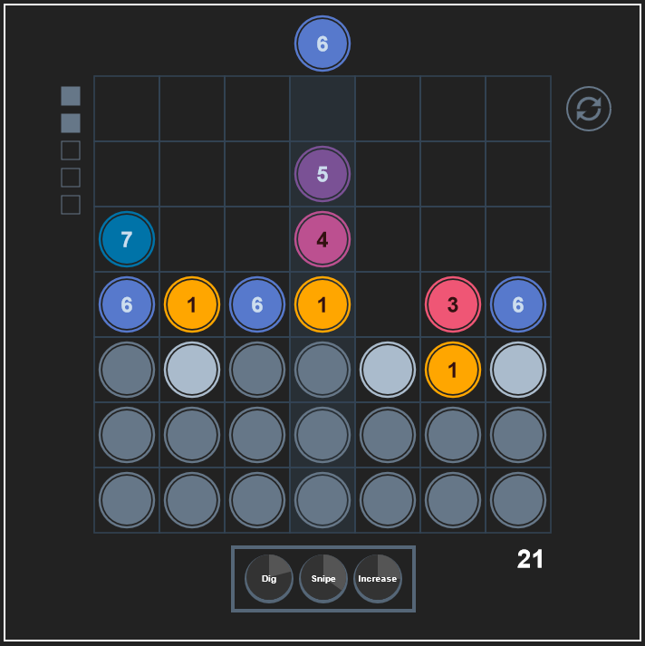

# DropFactor

A variant of [Drop7](https://en.wikipedia.org/wiki/Drop7), using elements of its predecessor [Chain Factor](http://www.franklantz.net/chainfactor).

Built using [Kontra.js](https://straker.github.io/kontra/).

## Gameplay

### Controls

- Click/tap and release within the grid to drop coins into the specified column.
- Click/tap and drag power tokens (once they're fully charged) to the grid to activate them.
- Press R or click/tap the restart button (top right) to restart the game.

### Rules

Each turn, the player can drop a coin with a value of 1 to 7 into any column of a grid. Coins will fall downwards until they hit the bottom of the grid or another coin.

If a coin finds itself in a contiguous row or column, the length which matches that coin's own value, it will disappear, digging up any adjacent "buried" coins (buried coins generally require two digs to uncover).

Powers will charge as score is increased. Once a power is fully charged, it can be activated by dragging its token to the desired activation point.

Each power has its own effect and range, these can be discovered through experimentation. A power's activation range is shown when dragging its token over the grid. If you decide not to use a power, release it outside of the grid.

Each round will progress as coins are dropped into the grid, or as powers are used. (Round progress is marked in the top left). After each round, a layer of buried coins will rise from the bottom of the grid, pushing everything else upwards.

If any dropped coin finds itself above the top of the grid, the game is over.

## Differences

At its core, the game mostly plays like the original Drop7 and Chain Factor. However, there are a few mechanical differences.

> NOTE: DropFactor is not intended to be a faithful remake or replacement for Drop7/Chain Factor, and many of these changes are experimental and untested for balance.

- Power system similar to Chain Factor's (Chain Factor has been archived and is still playable online to an extent, but its power system was gated by community progress through an ARG, and the server controlling which powers are available no longer seems to be online.)

    While Chain Factor allowed the player to choose from twelve different powers, here they have been narrowed down to the three I remember using the most in the original version of Chain Factor, with some minor alterations.

- A weighted randomisation system makes it so any individual coin value becomes more like to appear in the drop rotation for each turn it doesn't appear. This is intended to reduce (but not eliminate) situations where the same value coins appear multiple times in a row.

## Roadmap

This game is effectively complete outside of minor cosmetic improvements, performance optimisation and bugfixes.

## Credit

- [Frank Lantz](http://www.franklantz.net/chainfactor) - Developer of both the original games DropFactor is based on.
- [Drop-7 Professional](https://www.lexaloffle.com/bbs/?pid=35706) - A very good Pico-8 remake of Drop7, and a key inspiration behind this project.
- [Finite State Machines in JavaScript](https://www.youtube.com/watch?v=0NkfCi-hKCc) - Helped me understand a concept that became integral to the development of this game.
- [Vanilla Web - Poor Man's Signals](https://plainvanillaweb.com/blog/articles/2024-08-30-poor-mans-signals/) - Another concept used throughout DropFactor.
- [Kontra.js](https://straker.github.io/kontra/)
- [Webpack](https://webpack.js.org/)